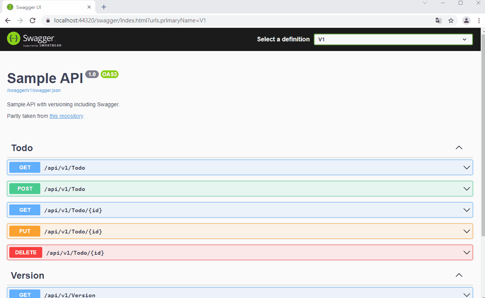

# ASP.NET-Core-RESTfulAPI
示範在.net core中建置RESTful API
### API規格
<table>
<tbody><tr><th>方法</th>
<th>網址</th>
<th>描述</th>
<th>要求文本</th>
<th>回應文本</th>
</tr><tr>
<td>GET</td>
<td><code>/api/todo</code></td>
<td>取得所有待辦事項</td>
<td>無</td>
<td>待辦事項陣列</td>
</tr>
<tr>
<td>GET</td>
<td><code>/api/todo/{id}</code></td>
<td>依識別碼取得待辦事項</td>
<td>無</td>
<td>待辦事項</td>
</tr>
<tr>
<td>POST</td>
<td><code>/api/todo</code></td>
<td>新增待辦事項</td>
<td>待辦事項</td>
<td>待辦事項</td>
</tr>
<tr>
<td>PUT</td>
<td><code>/api/todo/{id}</code></td>
<td>更新現有的待辦事項</td>
<td>待辦事項</td>
<td>待辦事項</td>
</tr>
<tr>
<td>DELETE</td>
<td><code>/api/todo/{id}</code></td>
<td>刪除待辦事項</td>
<td>無</td>
<td>待辦事項</td>
</tr>
<tr>
</tr></tbody></table>

### DEMO

